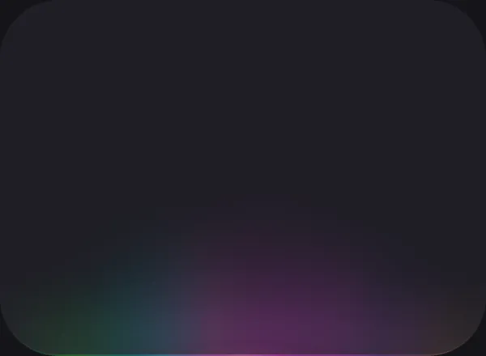
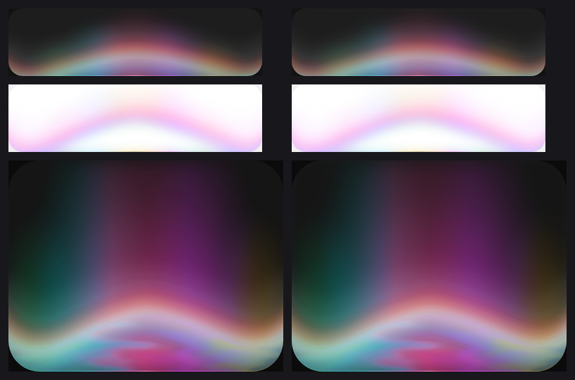
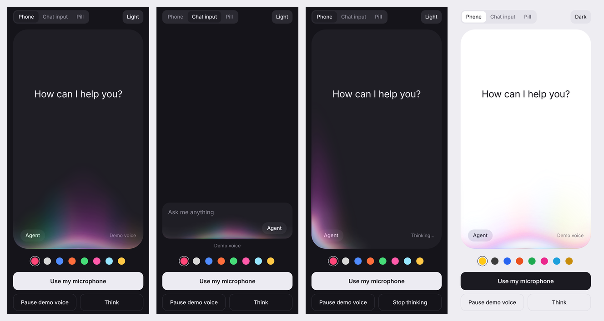

# react-native-voice-glow

A sound-reactive glow for React Native and Expo. A colourful beam rises from the bottom edge of a chat input or a phone screen and blooms with the level of a voice, so a voice agent feels like it is listening.

<p>
  
</p>
<p>
  
</p>

It is a React Native port of [voice-glow](https://libraries.dev/voice) by [Jakub Antalik](https://github.com/Jakubantalik/Libraries.dev), drawn with [React Native Skia](https://shopify.github.io/react-native-skia/) and driven by [Reanimated](https://docs.swmansion.com/react-native-reanimated/) on the UI thread. It renders the same picture as the web original: the tuned palettes, lobe geometry, band and envelope maths are carried over, and every frame is checked against the original pixel by pixel (see [Fidelity](#fidelity)).

## Install

Expo (SDK 57 or later):

```sh
npx expo install react-native-voice-glow @shopify/react-native-skia react-native-reanimated react-native-worklets expo-audio
```

Add the microphone permission text to `app.json`:

```json
{
  "expo": {
    "plugins": [["expo-audio", { "microphonePermission": "Allow $(PRODUCT_NAME) to hear your voice." }]]
  }
}
```

Bare React Native: install `@shopify/react-native-skia` and `react-native-reanimated` as their docs describe, then `react-native-voice-glow`, and either `expo-audio` or [`react-native-audio-api`](https://docs.swmansion.com/react-native-audio-api/) for the microphone.

## Quick start

```tsx
import { VoiceGlow } from 'react-native-voice-glow';
import { useMicrophone } from 'react-native-voice-glow/expo';

function Composer() {
  const mic = useMicrophone();

  return (
    <>
      <VoiceGlow source={mic.source}>
        <View style={{ height: 96, borderRadius: 20, backgroundColor: '#1d1d1d' }} />
      </VoiceGlow>
      <Button
        title={mic.state === 'live' ? 'Stop' : 'Listen'}
        onPress={mic.state === 'live' ? mic.stop : mic.start}
      />
    </>
  );
}
```

`VoiceGlow` wraps your view and draws the glow over it, clipped to its rounded corners. It reads the corner radius from the child's style, or takes `borderRadius`. Call `mic.start()` from a user action: it asks for permission the first time.

There are two microphone hooks with the same API. On React Native Web both use the browser's microphone.

- `react-native-voice-glow/expo` streams PCM from `expo-audio`. It uses only expo-audio, Skia and Reanimated, which all ship in Expo Go, so no development build is needed. On iOS, expo-audio switches the audio session to record-only while it listens, so anything else your app plays is silent until you stop; the hook hands the session back afterwards (`restoreAudioMode`).
- `react-native-voice-glow/audio-api` is built on `react-native-audio-api` and needs a development build. It listens and plays at the same time, which is what a voice agent that talks back needs. In Expo, give its config plugin the Android permission, because its list replaces the defaults:

```json
["react-native-audio-api", {
  "iosMicrophonePermission": "Allow $(PRODUCT_NAME) to hear your voice.",
  "androidPermissions": ["android.permission.RECORD_AUDIO", "android.permission.MODIFY_AUDIO_SETTINGS"]
}]
```

Microphones differ in level, so if the glow looks timid or saturates, adjust `sensitivity`.

## Driving it yourself

Without a `source`, the glow follows `level` (0 to 1). Pass a number, or a Reanimated shared value to update it every frame without re-rendering:

```tsx
const level = useSharedValue(0);
// level.value = …from your own meter, a speech API, playback…
<VoiceGlow level={level}>…</VoiceGlow>
```

To light it up from any audio you already have (a WebRTC track, the agent's TTS playback, another recording library), push the PCM samples and the glow analyses them exactly as the browser's `AnalyserNode` would, low, mid and high bands included:

```tsx
const voice = useVoiceInput();
// voice.pushPCM(float32Samples, sampleRate) whenever a buffer arrives
// voice.setRms(rms) if all you have is a level meter
<VoiceGlow source={voice.source}>…</VoiceGlow>
```

## Hosts, colours and themes

```tsx
<VoiceGlow type="default" />   // a ~350px chat input (default)
<VoiceGlow type="pill" />      // a ~150×44 recording pill
<VoiceGlow type="mobile" />    // the bottom of a phone screen

<VoiceGlow colorVariant="ocean" />  // colorful, mono, ocean, sunset, forest, candy, ice, gold
<VoiceGlow colors={['#ffc915', '#7ec4ff', '#b428e6']} />  // your own, centre lobe first
<VoiceGlow theme="light" />         // dark (default), light, or auto
```

`scale` sizes the whole effect at once. `active={false}` fades it out; `paused` freezes it in place.

## Motion: a thinking state

`motion` gathers the lobes into one beam and moves it, which is how you show the agent thinking after the user stops talking. Pass a shared value to animate it on the UI thread:

```tsx
const motion = useDerivedValue(() => ({
  gather: gather.value,        // 0 the voice glow, 1 one beam
  offset: side.value * 0.8,    // where the beam sits, -1 to 1
  heldLevel: 0.55,             // keeps the beam lit while nobody speaks
  cornerFollow: 1,             // ride the corners
}));
<VoiceGlow motion={motion}>…</VoiceGlow>
```

The example app has a complete version in `example/src/useThinkingMotion.ts`.

## Props

| Prop | Default | What it does |
| --- | --- | --- |
| `source` | | Live audio from `useMicrophone` or `useVoiceInput`. Wins over `level`. |
| `level` | `0` | Manual drive, 0 to 1: a number or a shared value. |
| `type` | `'default'` | `'default'`, `'pill'` or `'mobile'`: sets the geometry. |
| `theme` | `'dark'` | `'dark'`, `'light'` or `'auto'`. |
| `colorVariant` | `'colorful'` | One of the eight palettes. |
| `colors`, `bandColors` | | Your own lobe and band colours. |
| `sensitivity` | `3.1` | Input gain. Raise it for a quiet microphone. |
| `threshold` | `0.015` | Noise gate. |
| `attack`, `release` | `0.325`, `0.86` | Seconds to rise and to settle. |
| `idle` | `0.18` | Resting presence while silent. Set `0` for nothing. |
| `reach`, `spread` | per type | How tall and how wide it grows at full level. |
| `flow` | per type | Sideways drift of the colours while a voice is heard, px/s. |
| `bands` | `true` | Low, mid and high frequencies move the lobes separately. |
| `bend` | per type | How far the top contour humps up at full level, px. |
| `distortion` | per type | Shimmer under the band, 0 to 1. `0` turns it off (cheaper). |
| `motion` | | Gather the glow into a moving beam (see above). |
| `scale` | per type | Size of the whole effect. |
| `strength` | per theme | Opacity of the glow (never the children). |
| `active` | `true` | `false` fades the glow out and stops the frame loop. |
| `paused` | `false` | Freezes the glow without fading it. |
| `borderRadius` | from the child | Corner radius of the host. |
| `levelValue` | | A shared value written every frame with the smoothed level. |
| `onLevel` | | Same, as a JS callback (costs a thread hop per frame). |
| `onActivate`, `onDeactivate` | | Called when the fade in or out completes. |

The fine shape controls of the web library are all here too (`bandStrength`, `bandWidth`, `bandPosition`, `bandCurve`, `bandSpread`, `bandSkew`, `bandOffset`, `bandTail…`, `bandAberration`, `distortionDetail`, `glowWidth`, `glowHeight`, `lobeSpacing`, `rangeWidth`, `rangeHeight`, `softness`, `coreSize`, `coreLight…`, `strokeScale`, `innerScale`, `innerHeight`, `bloomScale`, `bloomHeight`, `brightness`, `saturation`, `glowSize`, `strokeOpacity`, `innerOpacity`, `bloomOpacity`, `hueRange`, `hueDuration`, `staticColors`, `breatheDuration`) with the same meaning and defaults. See [the web library's documentation](https://github.com/Jakubantalik/Libraries.dev/tree/main/packages/voice-glow#props) for each.

## How it works

Each frame, on the UI thread, a Reanimated frame callback reads the latest audio reading, shapes it (gain, noise gate, soft saturation), follows it with an attack and release envelope, advances the colour flow and the motion, and records a Skia picture of five layers clipped to the host's rounded rectangle:

1. the inner light: soft lobes inside the edge, with a faint inset rim;
2. the stroke: the lobes painted into the 1px edge ring, with a hot core;
3. the bloom: a blurred halo of the lobes;
4. the band: a luminous ridge along the bend, with red and blue fringes;
5. the epicentre: a white wash under the band (light theme).

The glow under the band is warped sideways by drifting fractal noise (a Skia displacement map). Hue drift, brightness and saturation are colour matrices, applied in the same order as the web's CSS filters. Nothing per-frame touches the JS thread, so the glow keeps moving while your app is busy, and it is capped at 60 fps so a 120 Hz screen does not double the work.

Audio is analysed on the JS thread as it arrives. `VoiceAnalyser` is the Web Audio `AnalyserNode` re-implemented in TypeScript (Blackman window, FFT, smoothing, decibel bytes), so native PCM produces the same readings the web component gets from the browser. It is checked against Chromium's own `AnalyserNode` on a voice-like signal.

## Fidelity



Left: the original web component in Chromium. Right: this library's engine and painter, rendered by Skia. Across the nine test scenes (dark and light, all three hosts, a different palette, the distortion on and off), the mean difference is 1 to 2.7 levels out of 255 per pixel and the 99th percentile at most 8. The live component running on React Native Web, drawn through Skia's WebGL backend, stays within 3.5 mean and 14 at the 99th percentile.

`npm test` runs these comparisons against the reference renders in `test/golden`, plus tests of the envelope, fades, reduced motion, the analyser and per-frame allocation. The code under test is compiled with the same Babel worklets plugin an app uses, so it is the code that runs on the UI thread. The scripts in `scripts/reference/` regenerate the references from the original source, compare the analyser with Chromium's, and check the live component on the web build of the example app.

## Accessibility

The glow is decorative: it takes no touches and is hidden from screen readers. When the system's Reduce Motion setting is on, the idle breathing, flow, hue drift and distortion stop, and the glow still reacts to the voice, because that is a meter rather than decoration.

## Performance notes

Each frame is built from several offscreen layers, with Gaussian blurs on the bloom, the band and the epicentre, and a displacement map when the distortion is on. The layers are only as tall as the glow reaches that frame, so a quiet glow on a phone screen draws a fraction of it.

Skia objects are built once and reused: react-native-skia reports each shader and image filter to the JS engine as 1 MB of native memory, so creating them every frame would keep the UI thread's garbage collector busy. After the first frame, the glow creates no shaders and at most four image filters a frame (the drifting distortion map), and none with `distortion={0}`. It draws in sRGB on every platform, as the web does.

A chat input is a small area. The `mobile` type covers a large part of the screen, so on a low-end Android phone start with `distortion={0}`, which also removes two of the layers. `active={false}` stops the frame loop entirely once the fade-out finishes.

This first release is verified by rendering through Skia and by running on React Native Web. It has not yet been profiled on physical iOS and Android devices; frame-time reports from real phones are very welcome.

## Differences from the web library

- `source` replaces `stream`, and `level` takes a shared value instead of a getter function.
- CSS hooks (`--voice-*` variables, `className`, `css`) have no React Native equivalent; use the props.
- `levelValue` replaces the `--vb-level` CSS variable.
- The wrapper does not clip its children (that would cost an offscreen pass on iOS); the glow clips itself to the corner radius. Give your own view its rounded corners.
- The unreleased dots and lines looks are not included, and neither are the web library's Pro features (the Studio and the ready-made processing state). The `motion` prop they are built on is here.

## Example app

```sh
cd example
npm install
npx expo start
```

It shows the glow on a phone screen, a chat input and a recording pill, with your microphone, a demo voice for the simulator, a thinking state, every palette and both themes.



## Credits

The design, the tuning and the original web implementation are Jakub Antalik's [voice-glow](https://libraries.dev/voice), part of [Libraries.dev](https://libraries.dev) (MIT). This library is an independent port and is not affiliated with Libraries.dev.

## License

MIT. See [LICENSE](LICENSE).
